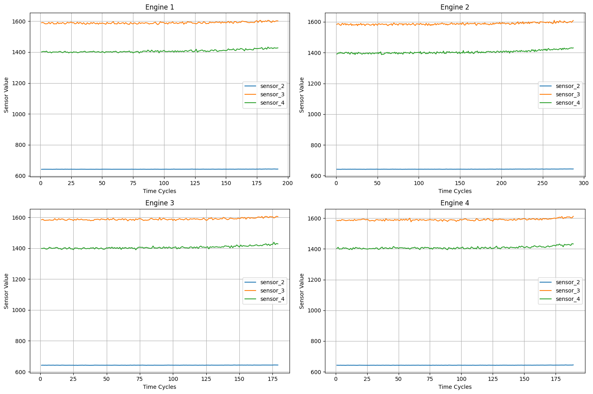
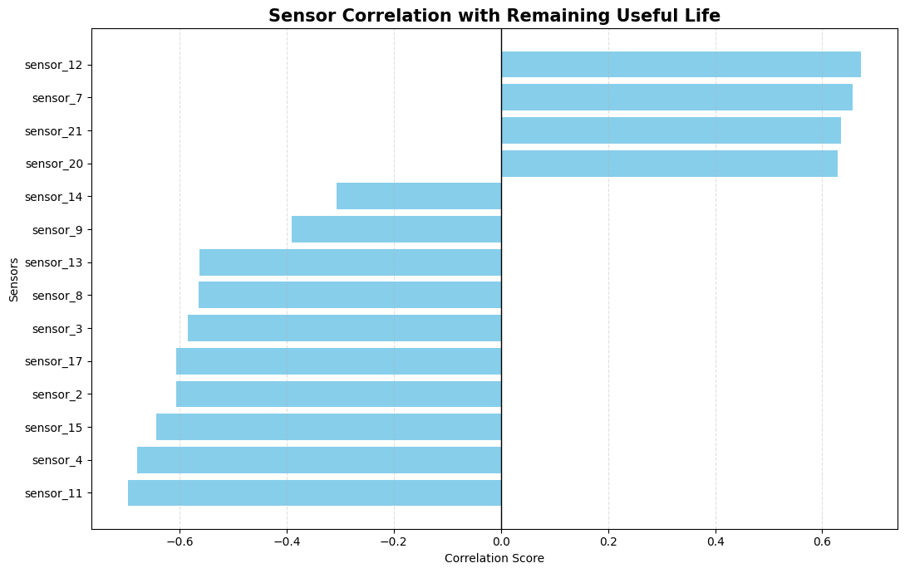
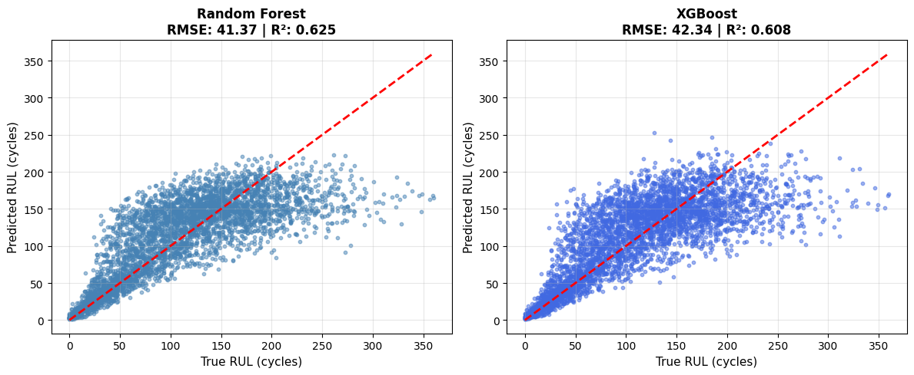
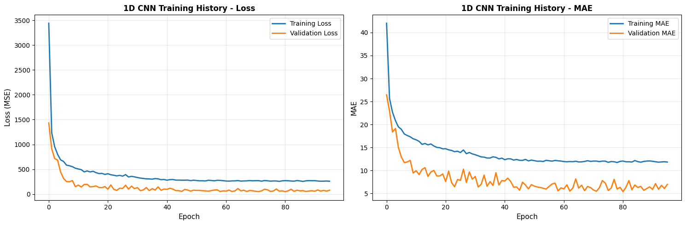
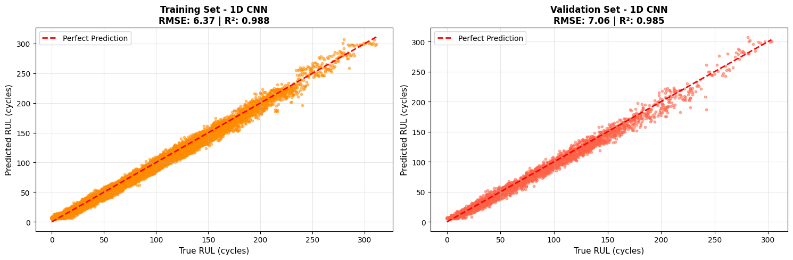
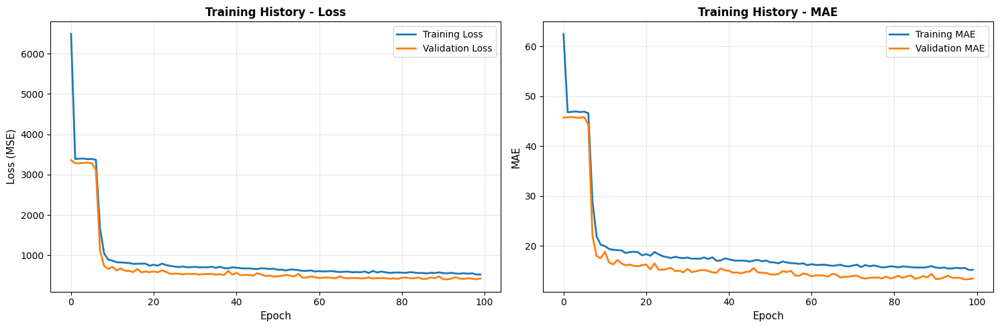
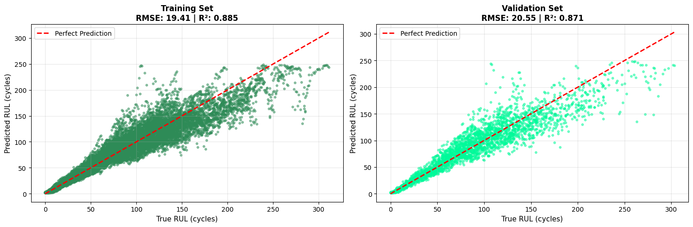
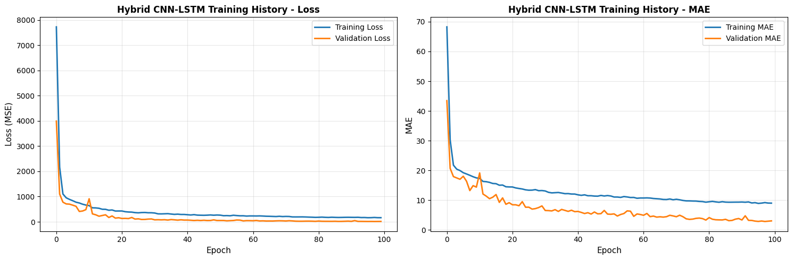
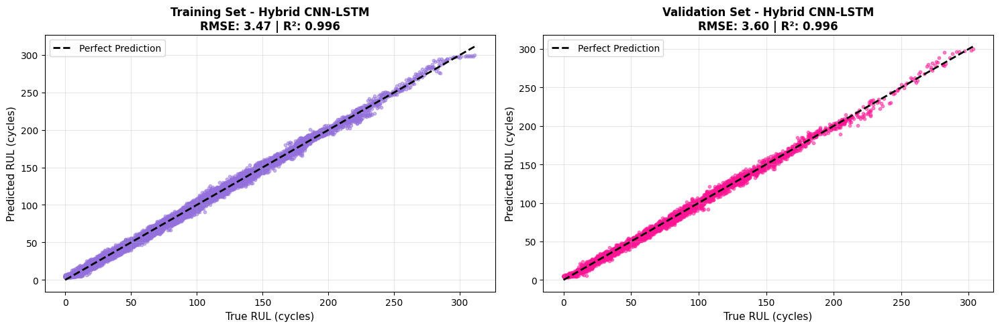

# RUL Prediction on NASA C-MAPSS Dataset

Benchmarking machine learning and deep learning models for Remaining Useful Life (RUL) prediction on turbofan engine sensor data.

---

## Overview

This project explores how well different ML and DL models can predict when an aircraft engine is going to fail, using NASA's publicly available C-MAPSS (FD001) dataset. The goal is to estimate the **Remaining Useful Life** of an engine — how many operational cycles it has left before failure.

Five models are implemented and compared end-to-end, from classical tree-based methods to a hybrid deep learning architecture:

- Random Forest
- XGBoost
- 1D CNN (PyTorch)
- LSTM (PyTorch)
- Hybrid CNN-LSTM (PyTorch)

---

## Dataset

The project uses **NASA's C-MAPSS FD001** dataset — a standard benchmark in predictive maintenance research.

The dataset simulates turbofan engine degradation under a single operating condition. Each engine starts healthy and runs until failure. The data includes:

- 100 engines in the training set
- 21 sensor readings per cycle (temperature, pressure, speed, fuel flow, etc.)
- 3 operational settings per cycle
- A continuous RUL label computed per row

> **Note:** The raw dataset files (`train_FD001.txt`, etc.) are not included in this repository. Download them from the [NASA Prognostics Data Repository](https://ti.arc.nasa.gov/tech/dash/groups/pcoe/prognostic-data-repository/) or from [Kaggle](https://www.kaggle.com/datasets/behrad3d/nasa-cmaps). Place the files in a `CMAPSSData/` folder at the root of the project.

---

## Project Structure

```
cmapss-rul-benchmark/
│
├── 1_data_preprocessing.ipynb   # EDA, RUL computation, feature selection, normalization
├── 2_ml_models.ipynb            # Random Forest and XGBoost baselines
├── 3_cnn.ipynb                  # 1D CNN using PyTorch
├── 4_lstm.ipynb                 # Stacked LSTM using PyTorch
├── 5_cnn-lstm.ipynb             # Hybrid CNN-LSTM using PyTorch
│
├── train_processed.csv          # Preprocessed training data (output of notebook 1)
├── feature_columns.pkl          # Saved list of selected feature names
└── requirements.txt             # Python dependencies
```

---

## Setup

**Requirements:** Python >= 3.8

```bash
pip install -r requirements.txt
```

Run notebooks in order:

```
1_data_preprocessing.ipynb   →  generates train_processed.csv and feature_columns.pkl
2_ml_models.ipynb            →  trains Random Forest and XGBoost
3_cnn.ipynb                  →  trains 1D CNN
4_lstm.ipynb                 →  trains LSTM
5_cnn-lstm.ipynb             →  trains Hybrid CNN-LSTM
```

---

## Data Preprocessing

**Notebook:** `1_data_preprocessing.ipynb`

The preprocessing pipeline covers:

- **RUL computation** — For each engine, RUL at cycle `t` = (max cycle for that engine) − t
- **Variance filtering** — Sensors with variance below 0.001 are dropped. 4 sensors removed, 17 retained.
- **Correlation analysis** — Pearson correlation of each sensor with RUL (chart below)
- **Normalization** — MinMaxScaler applied across the full training set
- **Sequence generation** — A sliding window of 50 cycles used as input for DL models

**Sensor readings for 4 sample engines over their operational life:**



*Sensors 3 and 4 show a gradual upward drift as engines approach failure — a clear degradation signal.*

**Pearson correlation of each sensor with RUL:**



*Sensors 12, 7, 21, and 20 have the strongest positive correlation with RUL; sensors 11, 4, 15, and 2 are most negatively correlated. All 17 retained sensors carry meaningful signal.*

---

## Results

All models are evaluated on an 80/20 train-validation split. Metrics below are reported on the **validation set**.

| Model              | Val RMSE (cycles) | Val MAE (cycles) | Val R²   |
|--------------------|-------------------|------------------|----------|
| Random Forest      | 41.37             | 29.48            | 0.6254   |
| XGBoost            | 42.34             | 30.22            | 0.6076   |
| 1D CNN             | 7.06              | 5.39             | 0.9848   |
| LSTM               | 20.55             | 13.41            | 0.8712   |
| **Hybrid CNN-LSTM**| **3.60**          | **2.84**         | **0.9960** |

The deep learning models significantly outperform the ML baselines. The hybrid CNN-LSTM achieves the best result across all three metrics, with a validation RMSE under 4 cycles.

---

## Model Results

### Random Forest and XGBoost

**Notebook:** `2_ml_models.ipynb`

Both models treat each timestep independently without considering the sequential nature of sensor data. They predict reasonably for low RUL values but diverge at higher RUL ranges where temporal context matters most.



*The scatter for both models is wide, particularly at mid-to-high RUL values. Both R² scores sit around 0.61–0.63, meaning roughly a third of the variance in RUL remains unexplained.*

---

### 1D CNN

**Notebook:** `3_cnn.ipynb`

Two convolutional blocks (`Conv1d → ReLU → BatchNorm → MaxPool → Dropout`) extract local patterns from the 50-cycle input window. The model converges quickly and generalises well, with very little gap between training and validation loss.

**Architecture:** Input `(batch, 50 cycles, 17 features)` → Conv Block 1 (64 filters) → Conv Block 2 (128 filters) → Flatten → Dense → RUL output



*Both loss and MAE drop sharply in the first 10 epochs and stabilise. The validation curve tracks the training curve closely, indicating no significant overfitting.*



*Predictions are tightly clustered around the perfect-prediction diagonal on both training and validation sets. Val RMSE: 7.06 cycles, R²: 0.985.*

---

### LSTM

**Notebook:** `4_lstm.ipynb`

A stacked two-layer LSTM (128 → 64 hidden units) with dropout between layers, followed by two dense layers. Total trainable parameters: ~127K. The LSTM captures temporal dependencies but requires more epochs to converge than the CNN.

**Architecture:** Input → LSTM(128) → Dropout(0.2) → LSTM(64) → Dropout(0.2) → Dense(32) → RUL output



*The loss curve shows a sharp drop around epoch 5–8 before stabilising. Both train and validation curves converge smoothly with no divergence.*



*More scatter than the CNN, especially at high RUL values. Val RMSE: 20.55 cycles, R²: 0.871. The LSTM understands the degradation trend but is less precise than the CNN at extracting local sensor patterns.*

---

### Hybrid CNN-LSTM

**Notebook:** `5_cnn-lstm.ipynb`

CNN layers first extract local features from the sensor window; the output is passed into an LSTM that captures how those features evolve over time. This combination consistently achieves the lowest error of all five models.

**Architecture:** Input → CNN Block (64→128 filters) → LSTM(64) → Dense(32) → RUL output



*Both train and validation curves descend steadily over 100 epochs with no signs of overfitting. The validation MAE drops below 5 cycles within the first 20 epochs.*



*Points are clustered tightly along the diagonal on both sets. Val RMSE: 3.60 cycles, R²: 0.996 — the best result in this benchmark.*

---

## Key Observations

- The ML baselines (Random Forest, XGBoost) underperform because they treat each row independently and miss the time-series structure of engine degradation.
- The standalone LSTM learns temporal trends but is weaker at picking up local sensor patterns compared to the CNN.
- The 1D CNN is surprisingly competitive given its simplicity — converging faster than the LSTM with a lower final error.
- The hybrid CNN-LSTM benefits from both: convolutional feature extraction followed by temporal modelling. The combination brings validation RMSE from ~41 cycles (ML) down to ~3.6 cycles.

---

## Training Configuration (DL Models)

All three deep learning models share the same training setup:

| Parameter            | Value                              |
|----------------------|------------------------------------|
| Sequence length      | 50 cycles                          |
| Optimizer            | Adam (lr = 0.001)                  |
| Loss function        | MSE                                |
| Max epochs           | 100                                |
| Early stopping       | Patience = 15                      |
| LR scheduler         | ReduceLROnPlateau (factor=0.5, patience=5) |
| Batch size           | 64                                 |
| Train / Val split    | 80 / 20                            |

---

## References

- Saxena, A., Goebel, K., Simon, D., & Eklund, N. (2008). *Damage Propagation Modeling for Aircraft Engine Run-to-Failure Simulation*. Proceedings of the 1st International Conference on Prognostics and Health Management (PHM08), Denver, CO.
- [NASA Prognostics Data Repository](https://ti.arc.nasa.gov/tech/dash/groups/pcoe/prognostic-data-repository/)
